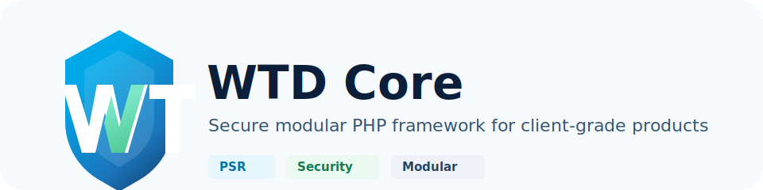

# WTD Core



A modern, lightweight, enterprise-ready PHP framework by Web Tech Domains.

Current version: `0.1.0-alpha`

## Vision
- Lightweight
- Secure
- Modular
- PSR-compliant
- Cloud-ready

The architecture baseline is documented in [docs/SOFTWARE_ARCHITECTURE_SPECIFICATION.md](docs/SOFTWARE_ARCHITECTURE_SPECIFICATION.md).
Practical guides are available from [docs/README.md](docs/README.md).
Application hook usage is documented in [docs/HOOKS.md](docs/HOOKS.md).

## Open Source

- License: [MIT](LICENSE)
- Contributing guide: [CONTRIBUTING.md](CONTRIBUTING.md)
- Git workflow: [docs/GIT_WORKFLOW.md](docs/GIT_WORKFLOW.md)
- Governance: [docs/GOVERNANCE.md](docs/GOVERNANCE.md)
- Release process: [docs/RELEASE_PROCESS.md](docs/RELEASE_PROCESS.md)
- Code of conduct: [CODE_OF_CONDUCT.md](CODE_OF_CONDUCT.md)
- Security policy: [SECURITY.md](SECURITY.md)
- Support policy: [SUPPORT.md](SUPPORT.md)
- Changelog: [CHANGELOG.md](CHANGELOG.md)

## Initial Roadmap
1. Foundation: kernel, bootstrap, container, config, environment, CLI
2. HTTP engine: request/response, middleware, routing
3. Validation
4. Database
5. ORM
6. Authentication
7. Authorization
8. Queue
9. Scheduler
10. Cache
11. Notifications
12. Storage
13. Testing
14. Documentation

## Development

```bash
composer install
npm install
copy .env.example .env
php core serve
php core serve --host=0.0.0.0 --port=8080
composer serve
php -S 127.0.0.1:8000 -t public public/index.php
npm run dev
composer test
composer analyse
composer cs:fix
npm run build
php core about
php core list
php core help
php core help health
php core config:cache
php core config:clear
php core cache:clear
php core make:controller HomeController
php core make:model User
php core make:command SyncCommand --command=app:sync
php core make:resource Post --model=Post
php core app:new demo
php core api:docs
php core ide:helper
php core benchmark / --iterations=100
php core marketplace:list
php core marketplace:install vendor/package
php core marketplace:publish vendor/package
php core tenant:list
php core ai:providers
php core monitor:report
php core migrate
php core migrate:rollback
php core db:seed
php core queue:work
php core schedule:run
php core test
php core deploy
php core optimize
php core optimize:clear
php core health
php core diagnostics
```

`composer install` and `composer update` run pending migrations automatically. Set `WTD_AUTO_MIGRATE=false` when installing dependencies without a configured database.

## Local Server

Use the `public` directory as the document root. For a quick local server:

```bash
php core serve
```

That is equivalent to Laravel's `php artisan serve`. To change the host or port:

```bash
php core serve --host=0.0.0.0 --port=8080
```

Composer also proxies to the same command:

```bash
composer serve
```

Or run PHP directly:

```bash
php -S 127.0.0.1:8000 -t public public/index.php
```

Open `http://127.0.0.1:8000`. Do not serve the project root in production; only `public/` should be web-accessible.

## Frontend Assets

Install Node dependencies and start Vite when developing CSS, JavaScript, Vue, or React files:

```bash
npm install
npm run dev
```

Build production assets into `public/build`:

```bash
npm run build
```

Link asset files through the Vite helper from controller data:

```php
return Response::make($this->views->render('home', [
    'assetTags' => vite('resources/js/app.js'),
]));
```

Then render those trusted tags with the raw placeholder syntax:

```html
{!! assetTags !!}
```

Normal placeholders like `{{ name }}` stay escaped for security.

## Current Phase

WTD Core has completed `0.1.0-alpha` foundation work, Phase 2 HTTP engine work, Phase 3 dependency injection work, Phase 4 validation work, Phase 5 database work, Phase 6 ORM work, Phase 7 authentication work, Phase 8 authorization work, Phase 9 security work, Phase 10 queue work, Phase 11 scheduler work, Phase 12 events work, Phase 13 notification work, Phase 14 mail work, Phase 15 cache work, Phase 16 storage work, Phase 17 CLI work, Phase 18 documentation work, Phase 18 developer experience work, and Phase 19 marketplace work. The current implementation includes the application lifecycle, service providers, configurable provider bootstrapping, dependency injection with transient, singleton, scoped, tagged, contextual, interface, factory, and auto-resolved services, file-based configuration loading and caching, environment loading, filesystem helpers, file logging, boot-time error handling, health reporting, persistent maintenance state, timing, memory metrics, a console kernel with parsed input, an HTTP kernel with exception rendering, 404/405 responses, full HTTP method routing, automatic OPTIONS responses, routing, route groups, domain routing, API versioning, named routes, URL generation, route caching, controller dispatch, redirect responses, file downloads, streaming responses, cookies, file-backed sessions, configurable global and route middleware, middleware pipeline, request validation helpers, form request validation classes with controller injection, nested and conditional validation rules, custom validation messages and rule extensions, HTTP 422 JSON validation error responses, PDO database foundation, query builder and grammar, database schema builder, migration runner with rollback support, database seeder runner support, database factories, query execution events, ORM models, ORM query scopes, HasOne, HasMany, BelongsTo, many-to-many, and polymorphic relationships, lifecycle events, observers, soft deletes, UUID keys, casting, accessors, mutators, repositories, session authentication, JWT, OAuth state protection, API tokens, password reset tokens, email verification tokens, remember-me tokens, magic link tokens, MFA TOTP, device management, RBAC, role permissions, policies, gates, ACL, role caching, CSRF protection, XSS escaping, SQL identifier validation, encryption, hashing, rate limiting, CORS, trusted proxy support, signed URLs, security headers, audit logging, secrets management, queue jobs, workers, failed jobs, retry, batches, priority queues, database, Redis, RabbitMQ, and SQS queue drivers, cron scheduling, timezone-aware scheduled tasks, overlap protection, background task flags, maintenance-mode filtering, the `schedule:run` command, event dispatching, listeners, subscribers, broadcasting, queued events, event discovery, notifications for email, SMS, WhatsApp, Telegram, Slack, Firebase, database, and webhooks, mail transports for SMTP, SES, Mailgun, Postmark, and SendGrid with markdown rendering, templates, attachments, and inline images, file, Redis, and Memcached cache stores, cache tags, atomic locks, cache events, local, S3, Cloudflare R2, Azure, Google Cloud, FTP, and SFTP storage disks, storage signed URLs, generators, project creation, queue work, cache management, testing helpers, deployment checks, practical guides covering getting started, architecture, CLI, HTTP, database, ORM, security, and operations, debug toolbar middleware, profiler snapshots, API documentation, OpenAPI generation, API resource generation, HTTP benchmark tooling, IDE helper generation, HTML error pages, local package marketplace discovery, package install metadata, package config publishing, and installed provider auto-registration.

Current PSR contract support includes PSR-4 autoloading, PSR-11 container interfaces, and PSR-3 logger interfaces.
